# amundsenrds
[](https://badge.fury.io/py/amundsen-rds)
[](LICENSE)
[](https://img.shields.io/badge/PRs-welcome-brightgreen.svg)
[](https://amundsenworkspace.slack.com/join/shared_invite/enQtNTk2ODQ1NDU1NDI0LTc3MzQyZmM0ZGFjNzg5MzY1MzJlZTg4YjQ4YTU0ZmMxYWU2MmVlMzhhY2MzMTc1MDg0MzRjNTA4MzRkMGE0Nzk)

Amundsenrds contains ORM models to support relational database as metadata backend store in Amundsen.
The schema in ORM models follows the logic of [databuilder models](https://github.com/amundsen-io/amundsendatabuilder/tree/master/databuilder/models).
Amundsenrds will be used in [databuilder](https://github.com/amundsen-io/amundsendatabuilder) and [metadatalibrary](https://github.com/amundsen-io/amundsenmetadatalibrary) for metadata storage and retrieval with relational databases.

## Model overview

```mermaid
erDiagram  
Database ||--o{ Cluster : "" 
Cluster ||--o{ Schema : "" 
Schema ||--o{ Table : ""
Schema ||--o| SchemaDescription : ""
Schema ||--o{ SchemaProgrammaticDescription : ""
Table ||--o| ApplicationTable : ""
Application ||--o{ ApplicationTable : ""
Table ||--o{ TableLineage : ""
TableLineage ||--|{ Table : ""
Table ||--o| TableDescription : ""
Table ||--o{ TableProgrammaticDescription : ""
Table ||--o| TableTimestamp : ""
Table ||--o{ TableTag : ""
Table ||--o{ TableBadge : ""
Badge ||--o{ TableBadge : ""
Table ||--o{ TableOwner : ""
Table ||--o{ TableFollower : ""
Table ||--o{ TableWatermark : ""
Table ||--o| TableSource : ""
Table ||--o{ TableUsage : ""
Table ||--|{ TableColumn : ""
TableColumn ||--o| ColumnDescription : ""
TableColumn ||--o{ ColumnStat : ""
TableColumn ||--o{ ColumnLineage : ""
ColumnLineage ||--|{ TableColumn : ""
TableColumn ||--o{ ColumnBadge : ""
Badge ||--o{ ColumnBadge : ""
DashboardCluster ||--o{ DashboardGroup : ""
DashboardGroup ||--o{ Dashboard : ""
Dashboard ||--o{ DashboardBadge : ""
Badge ||--o{ DashboardBadge : ""
Dashboard ||--o| DashboardDescription : ""
Dashboard ||--o| DashboardTimestamp : ""
Dashboard ||--o{ DashboardTag : ""
Dashboard ||--o{ DashboardOwner : ""
Dashboard ||--o{ DashboardFollower : ""
Dashboard ||--o{ DashboardUsage : ""
Dashboard ||--o{ DashboardTable : ""
Table ||--o{ DashboardTable : ""
Dashboard ||--o{ DashboardExecution : ""
Dashboard ||--o{ DashboardQuery : ""
DashboardQuery ||--o{ DashboardChart : ""
Tag ||--o{ DashboardTag : ""
DashboardGroup ||--o| DashboardGroupDescription : ""
User ||--o{ TableOwner : ""
User ||--o{ TableFollower : ""
User ||--o{ TableUsage : ""
User ||--o{ DashboardOwner : ""
User ||--o{ DashboardFollower : ""
User ||--o{ DashboardUsage : ""
UpdatedTimestamp
```


## Requirements
- Python: >= 3.6
- MySQL: 5.7, 8
  
**Note**: amundsen-rds(version >= 0.0.8) comes with SQLAlchemy ORM features supported only in MySQL 8 in the correlated amundsen [metadata-service](https://github.com/amundsen-io/amundsen/tree/main/metadata).
## Instructions to configure venv
- In the terminal window, change directory to [amundsen-rds](https://github.com/amundsen-io/amundsenrds]).
```
$ python3 -m venv venv
$ source venv/bin/activate  
$ pip3 install -r requirements.txt
$ python3 setup.py install
```
